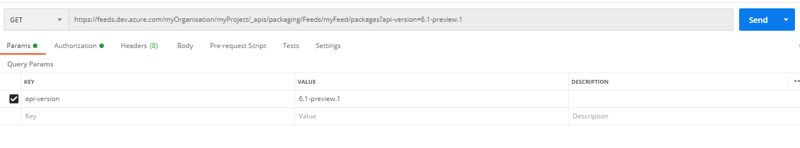
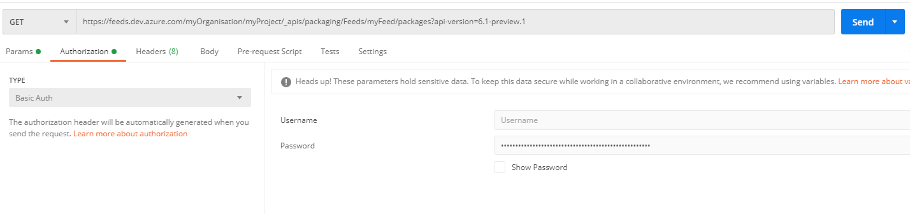
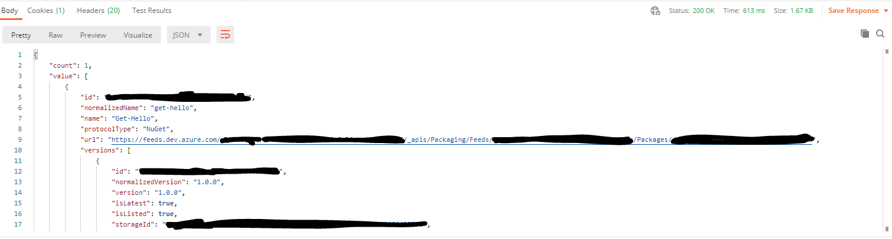

# Contributing to azd

Thank you for your interest and support in developing **azd**. 

## Steps to contribute

1. Visit [API documentation](https://docs.microsoft.com/en-us/rest/api/azure/devops/?WT.mc_id=docs-github-dbrown&view=azure-devops-rest-6.1)
and find the API that you want to support.
2. Get familiar with the REST API.
3. Fork this repository and create a branch for your work.
4. In your local development environment open the pom.xml file and sync to install dependencies.
5. If you are adding a new method to the existing class
    1. Update the version in `ApiVersion` file
    2. If you are adding any types, create a class and add it under `types` package. Please run the script `scrape.py`
    under `tools` folder to create the `types` needed.
6. Write tests first, this helps to decide on what is important and what to cover in the main class and method.
7. Write help. It is important to explain what the function does to the user.
8. Code the function/method.
9. Update `CHANGELOG.md`

## Developer Guide

- Install `Java` development kit 11 or higher
    * add `JAVA_HOME` to environment variables
- Install [Maven](https://maven.apache.org/download.cgi)
    * add `MAVEN_HOME` to environment variables
    
>**Note:** If you ran into "long path" issue on `Windows`, enable paths longer than 260 characters by: <br><br>
1.- Run this as Administrator on a command prompt:<br> 
`REG ADD HKLM\SYSTEM\CurrentControlSet\Control\FileSystem /v LongPathsEnabled /t REG_DWORD /d 1`<br>*(might need to type `yes` to override key if it already exists)*<br><br>
2.- Set up `git` by running:<br> `git config --system core.longpaths true`

## Exploring API

To access the REST API of **Azure DevOps** you are going to need personal access token. This will be used as the
authentication mechanism for accessing services in **Azure DevOps**. You can learn on how to create personal access
token from [here](https://docs.microsoft.com/en-us/azure/devops/organizations/accounts/use-personal-access-tokens-to-authenticate?WT.mc_id=docs-github-dbrown&view=azure-devops&tabs=preview-page).

In order to know the response from API you can use `postman`. It can be downloaded from [postman website](https://www.postman.com/downloads/).

It is good to begin with `GET` method first as it lists all the necessary responses, and we can create our own type
based on that. For instance lets take the artifact packages endpoint

```curl
GET https://feeds.dev.azure.com/{organization}/{project}/_apis/packaging/Feeds/{feedId}/packages?api-version=6.1-preview.1
```

You should replace `{organization}` with your organisation name, `{project}` with your project name and `{feedId}` with
the feed name from which you would like to fetch the packages.

Now, in `postman` it looks like this 



You need to set-up the authentication to get the response from API. To do that click on `Authorization` tab and select
`Basic Auth` from the drop down. You don't have to enter the username just enter your personal access token in password
section.



You are set to send the request. Click on `Send` and you will see the response from API if you have any packages
in your **Azure DevOps** artifacts.



## Fork the repository

It is good to get familiarised with the code by forking the repository and creating your own branch for your work.
You can then clone the repository to your development environment and start working.

## Important Section

- You should write unit test before you start writing the function/method/class. This way you can decide on how
the functionality of your code should be.
- You can use the existing class as template to create your own. This way we maintain consistent across the library.
- Maintain the versions of different endpoints in Versions.java class
- Manage all the types under `types` package and define your own if necessary
- Code your function and write help.
- Update `_unitTest.json` file under `test` package with your own organisation name, project and personal access token
to run unit tests.
- Once it's all done, update `CHANGELOG.md`.

