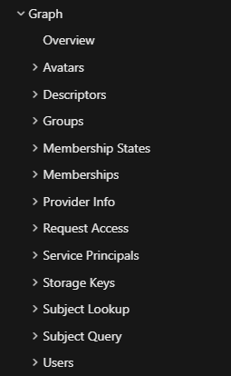
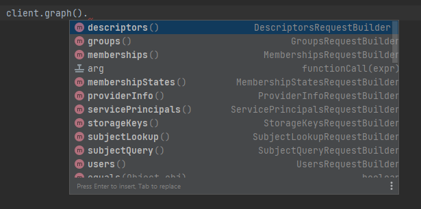

# azure-devops-java-sdk

[](https://dev.azure.com/harishkarthic/azure-devops-java-sdk/_build/latest?definitionId=8&branchName=main)
[](https://github.com/hkarthik7/azure-devops-java-sdk/blob/main/LICENSE)
[](https://azure-devops-java-sdk-docs.readthedocs.io/en/latest/?badge=latest)
[](https://search.maven.org/artifact/io.github.hkarthik7/azd/6.0.1/jar)

**azd** library provides a convenient way to manage and interact with **Azure DevOps Services** REST API with ease. This SDK offers a set of APIs and utilities
with declarative syntax and provide functionalities to the significant services.

You can view the [blog post](https://hkarthik7.github.io/azure%20devops/2020/12/04/AzureDevOpsJavaSDK.html) for details about the library.

## Features

- **Pagination**: For the APIs that return continuation token in the header, **azd** constructs the next page `url` and returns it with the response.
- **Retry**: Automatic retry is enabled and can be configured.
- **Proxy**: Configure proxy for the requests and optionally with proxy authentication.
- **Fluent API**: Request construction with fluent Api syntax.

## Documentation

- [Javadocs](https://hkarthik7.github.io/azd-docs/)
- [Examples](https://github.com/hkarthik7/azure-devops-java-sdk/blob/main/examples)
- [Read the docs](https://azure-devops-java-sdk-docs.readthedocs.io/en/latest/)

## Getting Started

### Install the SDK

To download the library and use it in your project, just add below in your pom.xml file.

```xml
<dependency>
  <groupId>io.github.hkarthik7</groupId>
  <artifactId>azd</artifactId>
  <version>6.0.1</version>
</dependency>
```

**Java docs**

```xml
<dependency>
    <groupId>io.github.hkarthik7</groupId>
    <artifactId>azd</artifactId>
    <version>6.0.1</version>
    <classifier>javadoc</classifier>
</dependency>
```

**Source jar**

```xml
<dependency>
    <groupId>io.github.hkarthik7</groupId>
    <artifactId>azd</artifactId>
    <version>6.0.1</version>
    <classifier>sources</classifier>
</dependency>
```

### Choose authentication provider

- Choose the authentication provider.

**Authentication using personal access token**

```java
public class Main {
    public static void main(String[] args) {
        String personalAccessToken = "myToken";
        String project = "myProject";
        String baseUrl = "https://dev.azure.com/{organization}";
        // or TFS URL
        String baseUrl = "https://{server:port}/tfs/{collection}";

        AccessTokenCredential pat = new PersonalAccessTokenCredential(baseUrl, project, personalAccessToken);
    }
}
```

**Authentication using OAuth token**

- [Reference documentation](https://learn.microsoft.com/en-us/azure/devops/integrate/get-started/authentication/azure-devops-oauth?view=azure-devops)

```java
public class Main {
    public static void main(String[] args) {
        String project = "myProject";
        String baseUrl = "https://dev.azure.com/{organization}";
        // or TFS URL
        String baseUrl = "https://{server:port}/tfs/{collection}";

        String appSecret = "registeredAppSecret";
        String authorizationCode = "short lived auth code";
        String callBackUrl = "redirect or callback url here";

        AccessTokenCredential oauth = new OAuthAccessTokenCredential(baseUrl, project, appSecret, authorizationCode, callBackUrl);
    }
}
```

- Sample usage

```java

public class Main {
    public static void main(String[] args) {
        // Create client object.
        AzDServiceClient client = AzDService.builder().authentication(pat).buildClient();
        // or
        AzDServiceClient client = AzDService.builder().authentication(oauth).buildClient();

        try {
            // Get the list of projects. This return a future object.
            CompletableFuture<Projects> futureProjects = client.core().projects().listAsync();

            // All the Apis have overloaded methods. To get the list of project run,
            Projects projects = client.core().projects().list();

            projects.stream()
                    .map(Project::getName)
                    .forEach(System.out::println);

            // Create default Scrum project.
            ProjectCreationParameters projectParams = new ProjectCreationParameters();
            projectParams.name = "My new project";
            projectParams.description = "New sample project.";
            projectParams.templateTypeId = "6b724908-ef14-45cf-84f8-768b5384da45";
            projectParams.sourceControlType = "Git";

            client.core().projects().create(projectParams);

            futureProjects.join();

            // List all repositories
            client.git().repositories().listAsync();
        } catch (AzDException e1) {
            e1.printStackTrace();
        }
    }

}
```

- Pagination

Apis that returns `x-ms-continuation` token has a method `getNextPageLink()` that constructs the next page url with continuation token appended. This can then
be used to query next set of results.

```java
public class Main {
    public static void main(String[] args) {
        Builds builds = client.build().builds().list(r -> {
            r.queryParameters.top = 10;
            r.queryParameters.queryOrder = BuildQueryOrder.START_TIME_DESCENDING;
            r.queryParameters.reasonFilter = BuildReason.ALL;
        });
        if (builds != null)
            // Get current set of results.
            builds.getBuildResults().stream().map(b -> Integer.toString(b.getId())).collect(Collectors.joining(", "));
        while (builds != null) {
            // Get next page
            builds = ClientRequest.builder(client.accessTokenCredential())
                    .URI(builds.getNextPageLink())
                    .build()
                    .execute(Builds.class);
            if (builds.getNextPageLink() == null) break;
            else
                builds.getBuildResults().stream().map(b -> Integer.toString(b.getId())).collect(Collectors.joining(", "));
        }
    }
}
```

- Proxy

Set proxy configuration and optionally with proxy authentication.

```java
public class Main {
    public static void main(String[] args) {
        ProxyConfiguration proxyConfiguration = new ProxyConfiguration();
        proxyConfiguration.proxyUrl = "http://localhost";
        proxyConfiguration.proxyPort = 8888;

        // Optionally with username and password
        proxyConfiguration.proxyUsername = System.getenv("http.proxy_username");
        proxyConfiguration.proxyPassword = System.getenv("http.proxy_password");
        proxyConfiguration.noProxyHosts = List.of("hostname");

        client.configuration().proxy(proxyConfiguration);
    }
}
```

- Helpers package

Helper methods in legacy APIs are re-implemented in `helpers` package. The Apis in helpers package are easy to use reusable code that extends from new implementation.

**Easily clone a build pipeline**

```java
public class Main {
    public static void main(String[] args) {
        try {
            // Clone an existing pipeline with the pipeline name
            String ciName = "DeployTo-WebApp-CI";
            String ciCloneName = "DeployTo-WebApp-CI-Copy";

            client.helpers().build().cloneBuildDefinition(ciName, ciCloneName);

        } catch (AzDException e1) {
            e1.printStackTrace();
        }
    }

}
```

**Fork a repository**

```java
public class Main {
    public static void main(String[] args) {
        try {
            // Fork a repository
            GitRepository repo = client.git().repositories().get("myRepo");
            String projectId = repo.getProject().getId();

            GitRepository parentRepo = client.git().repositories().get("myParentRepo");
            String parentProjectId = parentRepo.getProject().getId();

            client.helpers().git().createForkRepository(repo.getName(), projectId, parentProjectId, parentRepo.getName());

        } catch (AzDException e1) {
            e1.printStackTrace();
        }
    }
}
```

- Advanced

**Create your own extension or call any Azure DevOps Api**

For instance, call Identities Api - [documentation](https://learn.microsoft.com/en-us/rest/api/azure/devops/ims/identities/read-identities?view=azure-devops-rest-7.1&tabs=HTTP#identity)

Use the script under [tools](https://github.com/hkarthik7/azure-devops-java-sdk/tree/main/tools) directory to automatically generate the Identity model class as mentioned
[here](https://learn.microsoft.com/en-us/rest/api/azure/devops/ims/identities/read-identities?view=azure-devops-rest-7.1&tabs=HTTP#identity).

```java
public class Main {
    public static void main(String[] args) {
        try {
            // Get the location URL
            // This returns https://vssps.dev.azure.com/{organization}
            String locationUrl = client.locations().getUrl(ResourceId.IDENTITIES);
            System.out.println(locationUrl);

            // Get the descriptor of authenticated user.
            String descriptors = client.locations().getConnectionData().getAuthenticatedUser().getDescriptor();

            // Construct the request URI
            URI requestUri = UrlBuilder.fromBaseUrl(locationUrl) // https://vssps.dev.azure.com/{organization}
                    .appendPath(Constants.APIS_RELATIVE_PATH) // /_apis
                    .appendPath("identities") // /identities
                    .appendQueryString(Constants.API_VERSION, ApiVersion.IDENTITY) // ?api-version=7.1
                    .appendQueryString("descriptors", descriptors) // &descriptors={descriptors}
                    .build(); // https://vssps.dev.azure.com/{organization}/_apis/identities?api-version=7.1

            System.out.println(requestUri);

            // Call Azure DevOps REST API.
            String response = ClientRequest.builder(client.accessTokenCredential())
                    .URI(requestUri)
                    .build()
                    .executeString(); // Or use Async method

            System.out.println(response);

        } catch (AzDException e1) {
            e1.printStackTrace();
        }
    }
}
```

## Documentation vs Api usage

Client object is constructed in a way that you navigate the documentation.



### vs



## Release Notes

- [Change Log](CHANGELOG.md)

## Dependencies

| NAME                       | VERSION |
| -------------------------- |---------|
| com.fasterxml.jackson.core | v2.17.2 |

## Build Locally

You are going to need JDK version 11 or above and can be downloaded from [here](https://www.oracle.com/java/technologies/javase-downloads.html).
Download Maven from the [official website](https://maven.apache.org/download.cgi). Once it is installed add `JAVA_HOME` to the path as Maven is
going to need it. You can check if Maven is installed correctly by running `mvn -v`.

Once you have installed `JDK` and `Maven` you can then,

Clone the repository and navigate to root of the folder where `pom.xml` is placed.

- Run `mvn clean` to clean the target folder if any exists
- Update `_unitTest.json` with your organisation name, project name and personal access token.
- Run `mvn test` to run unit tests
- Run `mvn package` to install the dependencies and create the resultant `.jar` file.

## License

This project is licensed under [MIT](LICENSE)

## Contributors

See [Contribution Guidelines](.github/CONTRIBUTING.md)